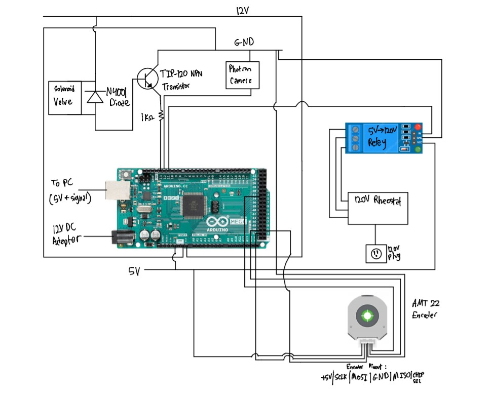

#  Smoke Flow Visualization Setup
This set of code is for the control of the smoke flow visualization experimental setup at the FCET lab wind tunnel in UTIAS. 
Using an Arduino which receives input from the user or active grid encoder, the circuit outputs timed controls to the valve, heated nichrome wire and camera to create and photograph the smoke flow.

## Further Information: Project Abstract
### Automation of the FCET Wind Tunnel Smoke Flow Visualization Rig
When analyzing the properties and features of flow around aerodynamic devices, there are quantitative techniques such as PIV and hot wire anemometry while on the other hand smoke flow visualization provides a simpler and qualitative look at the flow field. This technique consists of a nichrome wire that is coated in propylene glycol and is heated to create lines of smoke through the wind tunnel and it allows for the quick identification of key features such as boundary layers, laminar/turbulent flow and vortex shedding. Currently, each instrument in the setup is controlled manually and is only effective for flow speeds under 5 m/s, therefore limiting the precision of equipment usage for unsteady conditions and the range of possible cases to study. This project aims to increase the efficiency, precision, and versatility of the smoke flow setup by automating the process using a microcontroller, as well as implementing capacitors to rapidly discharge high levels of current for usage above 5 m/s. The desired circuit and code design will obtain inputs either from an encoder signal on the active grid (which creates unsteady conditions) or a trigger by the user and output timed controls to the wire heating, the valve which dispenses propylene glycol, the high-speed camera, and the charging/discharging of the capacitors. Different input/output devices will be chosen based on the metrics of usability, compatibility and responsiveness. Ultimately, this system will maximize usage of smoke flow and aid in the research papers regarding laminar separation bubbles.

## Code Structure
This code was operated using Ardino code which uses C++ and Python. The Arduino code controls the high/low signals and communication to the smoke flow instruments while the Python code controls the user interface and manual or automated control of these signals.

### Python Environment
This project uses the Anaconda virtual Python environment. The Pyserial package is installed to communicate with the Arduino using Python. The commands below were used to create a virtual envrionment and install Pyserial.
```
> conda create --name arduino python=3.7
> conda activate arduino
(arduino) > conda install pyserial
```
## Smoke Flow Circuit Diagram


## Other Software Used
PFV4 is used for the control and processing of the photos taken from the high-speed Photron Fastcam SA5

## File Descriptions
* **.vscode**: VS Code setup files
* **AMT22_SPI_Uno.ino**: Original, unmodified code to read encoder output from CUI Inc. website
* **A_control_manual.ino**: Currently used Arduino code with Arduino Mega
* **A_control_manual_test.ino**: Arduino code that is being tested but not ready
* **A_control_manual_uno.ino**: Arduino code, but for Arduino Uno microcontroller
* **Media**: Setup diagrams and other pictures
* **control_ard.ino**: Version 1 of Arduino code
* **control_V1.py**: Version 1 of Python control code
* **control_ag.py**: Python control code for unsteady case with active grid and encoder
* **control_manual.py**: Python control code with componenets manually triggered on/off by user
* **control_sequence.py**: Python control code with timed sequence controlling all compoenents automatically
* **desktop.ini**: Ignore

## Version Status
This current version supports manual and automated control for steady-state conditions under 5m/s without the active grid or capacitors
