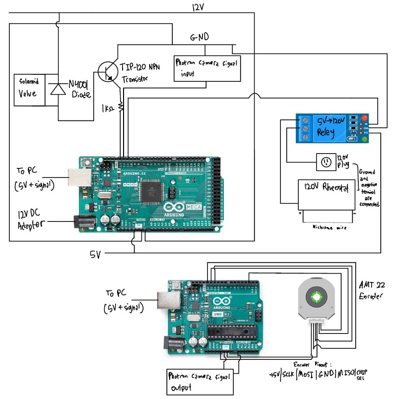
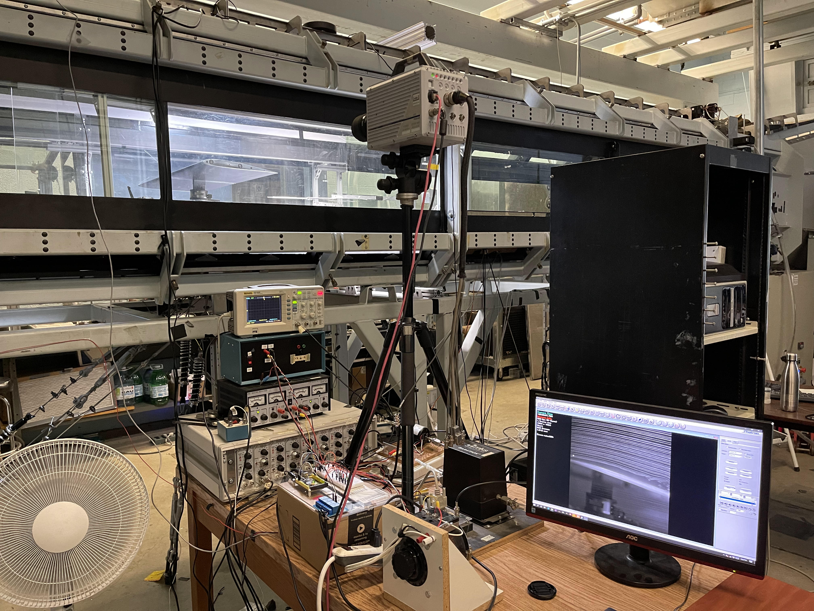
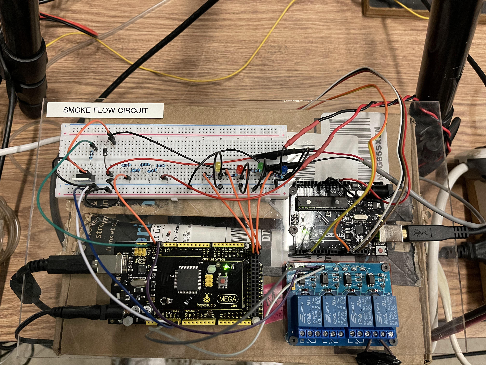

#  Smoke Flow Visualization Setup
This set of code is for the control of the smoke flow visualization experimental setup at the FCET lab wind tunnel in UTIAS. 
Using an Arduino which receives input from the user or active grid encoder, the circuit outputs timed controls to the valve, heated nichrome wire and camera to create and photograph the smoke flow.

## Further Information
### [Project Information + Progress Document](https://docs.google.com/document/d/1TpjQxDYd5ZbAC--HKGrwxiYLXjzm-MVlI9GUeiGMbgY/edit?usp=sharing)
### [Project Presentation](https://docs.google.com/presentation/d/1Sq_wyhLVnCP48-y7gE646tIXf9qmjQ5rv_RyZEfXHPY/edit?usp=sharing)

### Project Abstract: Automation of a Wind Tunnel Smoke Flow Visualization (SFV) Rig
When analyzing the properties and features of flow around aerodynamic devices, there are quantitative techniques such as particle image velocimetry (PIV) and hot-wire anemometry, while the SFV method provides a simpler set-up and qualitative look at the flow field. The SFV technique consists of a nichrome wire that is coated in propylene glycol and is heated to create lines of smoke through the wind tunnel. It allows for the visual identification of key features such as boundary layers, laminar or turbulent flow and vortex shedding. Currently, each instrument in the setup is controlled manually and is only effective for flow speeds under 5 m/s, therefore limiting the precision of equipment usage for unsteady conditions and the range of possible cases to study. This project aims to increase the efficiency, precision, and versatility of the SFV setup by automating the components using a microcontroller, as well as implementing capacitors to rapidly discharge high levels of current for usage above 5 m/s. The desired circuit and code design will obtain inputs either from an encoder signal or a manual trigger and output precise, timed controls to the wire heating, the dispensing of propylene glycol, the camera, and the capacitors. Design solutions will be evaluated based on the metrics of usability, compatibility and responsiveness. Ultimately, this system maximized usage of SFV and aided in the studies of laminar separation bubbles. Through iterative design and evaluation of metrics, the created design was able to produce informative images in a consistent manner while additions are being made to augment the usage of the instruments through the ability to read and save data.

## Code Structure
This code was operated using Ardino code which uses C++ and Python. The Arduino code controls the high/low signals and communication to the smoke flow instruments while the Python code controls the user interface and manual or automated control of these signals.

### Python Environment
This project uses the virutalenv Python environment. The Pyserial package is installed to communicate with the Arduino using Python. Matplotlib and Pandas packages are installed for encoder data graphing The commands below were used to create a virtual envrionment and install the additonal packages.
```
> pip install virtualenv
> python3 -m venv smokeflow
> smokeflow\Scripts\activate.bat
(smokeflow) > pip install pyserial
(smokeflow) > pip install matplotlib
(smokeflow) > pip install pandas
```
## Smoke Flow Circuit Diagram and Experimental Setup Photos




## Example Smoke Flow Photos
### Re 60k, Alpha 8°, Separation Bubble


### Re 60k, Alpha 4°, Wake


## Other Software Used
PFV4 is used for the control and processing of the photos taken from the high-speed Photron Fastcam SA5

## File Descriptions
* **.vscode**: VS Code setup files
* **__pycache__**: Python cache files
* **arduino/AMT22_SPI_Uno.ino**: Original, unmodified code to read encoder output from CUI Inc. website (not used)
* **arduino/commMega.ino**: Currently used Arduino code with Arduino Mega
* **arduino/encUno.ino**: Code for the second Arduino used which recieves input from the encoder on the active grid
* **data**: Encoder data csv and graph files
* **dataAcquisition/create_csv.py**: Creates csv for encoder data (not used)
* **dataAcquisition/create_plot_phase.py**: Creates phase plot for encoder data, converting time axis
* **dataAcquisition/freq.py**: Interpolates frequency from encoder graph, separate from ctrl_ag version (testing purposes)
* **dataAcquisition/testEnc.py**: Code for just running and testing encoder output performance (testing purposes)
* **media**: Setup diagrams and other pictures
* **steady/ctrl_V1.py**: Version 1 of Python control code (not used)
* **steady/ctrl_man.py**: Python control code with componenets manually triggered on/off by user
* **steady/ctrl_seq.py**: Python control code with timed sequence controlling all compoenents automatically
* **unsteady/ctrl_ag.py**: Python control code for unsteady case with active grid and encoder and graphing ability in burst mode
* **unsteady/ctrl_ag_V1.py**: Version 1 of Python control code for unsteady case with active grid and encoder (not used)
* **unsteady/ctrl_ag_cont.py**: Python control code for unsteady case with active grid and encoder and graphing ability in continuous mode
* **unsteady/ctrl_ag_live.py**: Runs control_ag_V1.py and create_plot_phase.py for live plotting using threading and subprocess (not used)

## Version Status
### v1.0
This version supports manual and automated control for steady-state conditions under 5m/s without the active grid or capacitors
### v2.0
This current version supports v1.0 features and automated control triggered by the active grid encoder with a second Arduino

## Contributors
Project by: Daniel Asadi, University of Toronto, Division of Engineering Science

Assisted by: Daniel Foster, University of Toronto, Division of Engineering Science

Supervised by: Suraj Banal, FCET Lab, UTIAS and Professor Philippe Lavoie, FCET Lab, UTIAS


